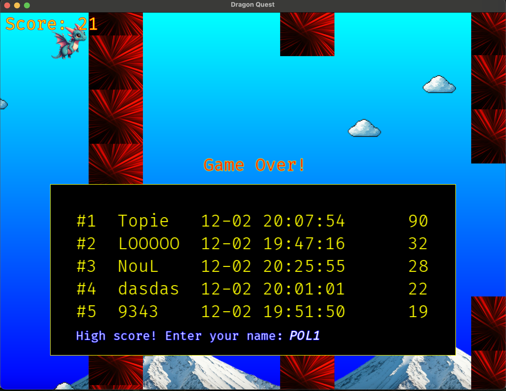

# Installation
## Prerequisites
C++ compiler such as G++ must be installed in your computer.
## Install CMake
https://cmake.org/download/
## Install SFML
https://www.sfml-dev.org/tutorials/2.6/start-vc.php

Or in MacOS, straightly install with brew
```
brew install sfml
```

# Compile
From command prompt, go to the working directory `cpp-game` and run
```
cmake .
```

Execute
```
cmake --build .
```

# Run Program
Go to `bin` directory, `cd bin`

In MacOS, run
```
./DragonQuest
```